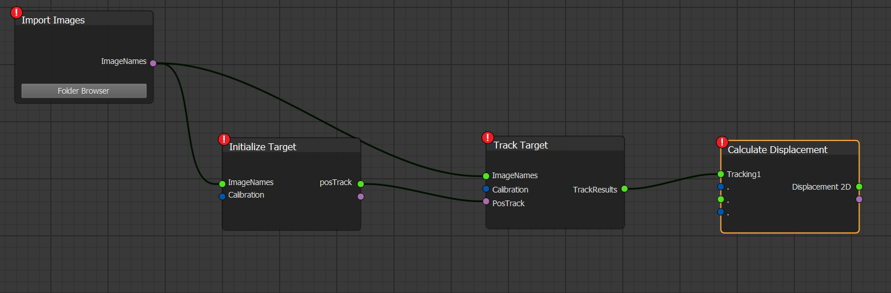
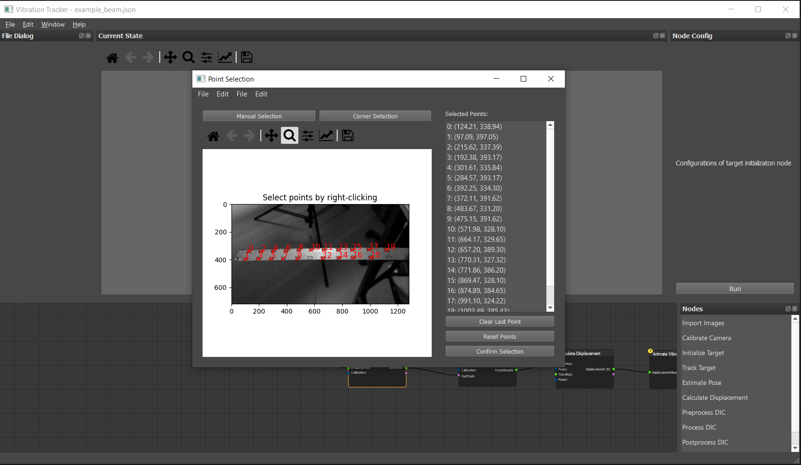
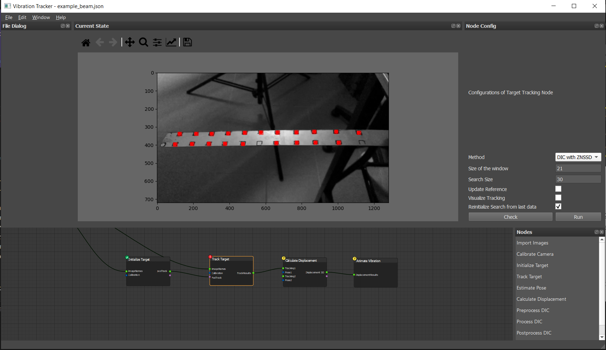
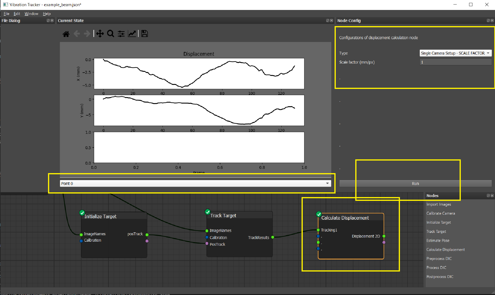

# Tutorial 1: Tracking Targets on a Vibrating Beam with a Single Camera

## Context

- **Image Acquisition**: A smartphone camera (iPhone X) was used in slow-motion mode.
- **Experiment Setup**: A beam with targets attached to its surface was fixed at one end and vibrated manually from the fixed side.
- **Data**: 130 sequential images are available in the example folder: `./images/beam`. 
- This dataset `beam` can be downloaded using repository 

This tutorial demonstrates the process of tracking targets on the beam using the following steps:

1. Import images
2. Initialize targets
3. Track targets
4. Calculate displacement
5. Animate vibration

---

## Image Processing Workflow with Vibration Tracker

Below is the pipeline for processing vibration tracking:

*Nodes can be created by right-clicking or dragging them from the node list.*  
*Alternatively, you can load the pre-built pipeline (`tutorials/example_beam.json`).*

---

### Step 1: Import Images

- Click the **Folder Browser** button and locate the folder containing the images.  
  Example: `./images/beam`.

---

### Step 2: Initialize Targets

1. Click the **Initialize Target** node.
2. In the **Node Config** widget:
   - Click **Run**.
  
3. There is a new window named "Point Selection":
   - Click *Manual Selection*
   - Use the *Right Mouse Button* to select points of interest on the image.
   - After selecting all points, click the **Confirm Selection** button.

---

### Step 3: Track Targets

1. Click the **Track Target** node.
2. Configure tracking in the **Node Config** widget:
   - **Tracking Method**: Choose **DIC with ZNSSD**.
   - **Subset Size**: Define the tracking window size around the target point (e.g., 21 pixels).
   - **Search Size**: Set the search area with a larger value then expected displacement between frames (e.g., 30 pixels).
   - **Reference Options**: 
     - To use last image and last track data as the reference.
     - Not to update the reference target, we will disable this option.
   - **Visualization**: Enable *Visualize Tracking* if needed.
   - **Reinitialize Search**: Enable *Reinitialize Search from Last Data* for optimization.
3. Click **Check** to preview the tracking window.
4. Click **Run** to execute the tracking process.

---

### Step 4: Calculate Displacement

The 2D displacement of the beam is retrieved with a scale factor assuming the motion occurs parallel to the image plane. Even though it is not the case with this vibrating beam, we will use it for the demostration.
Using a scale factor, pixel displacement is converted to metric displacement.

1. Click the **Calculate Displacement** node.
2. In the **Node Config** widget:
   - Select **Single Camera Setup - SCALE FACTOR**.
   - Enter the scale factor (e.g., mm/px).
3. Click **Run** to compute displacements for the X (horizontal) and Y (vertical) axes.
4. Use the combobox to switch between points of interest.

---

#### Note

All datas are saved in the document with the same name of your "json file".
For example, `example_beam.json` -> `example_beam/`
