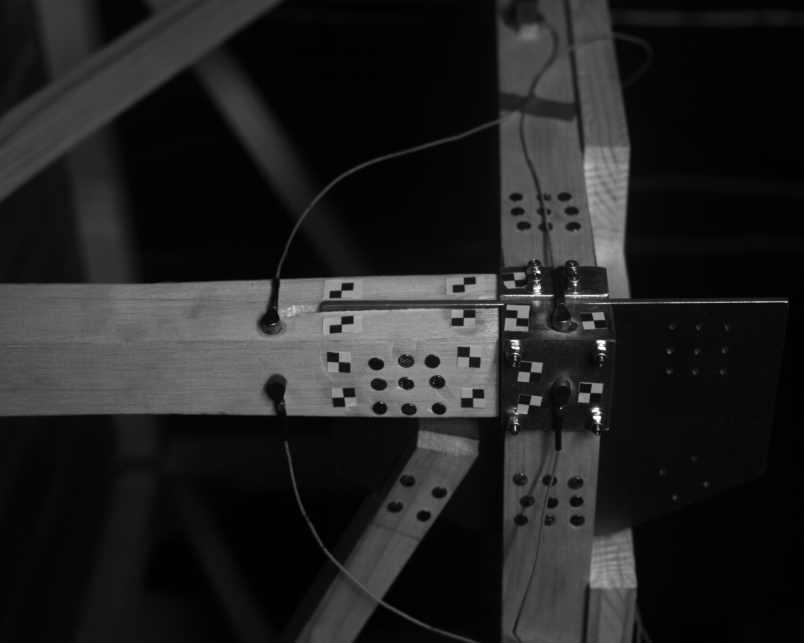
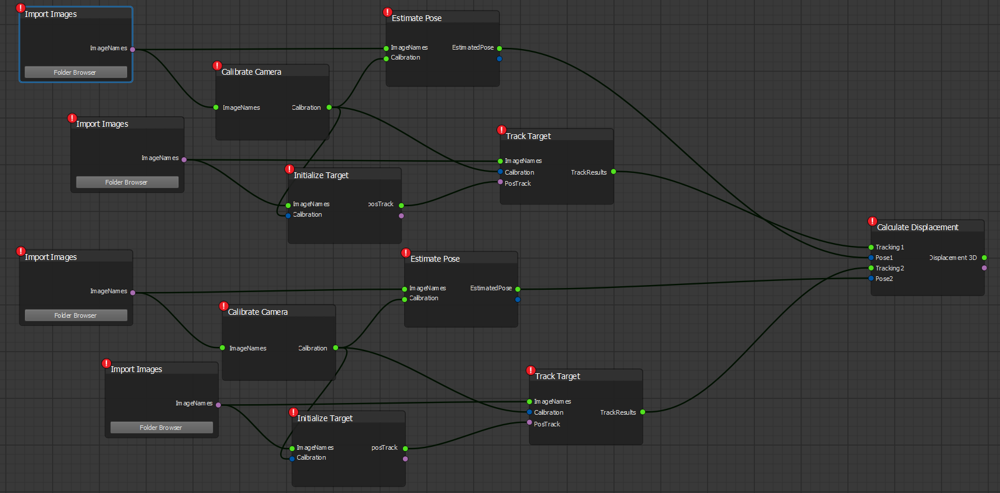
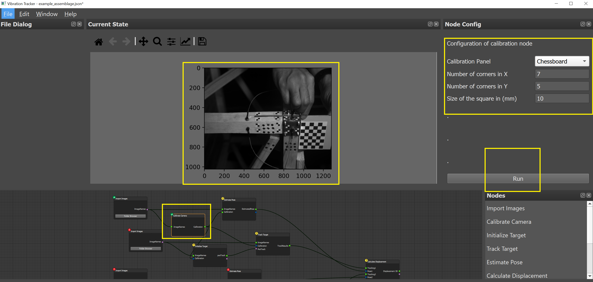
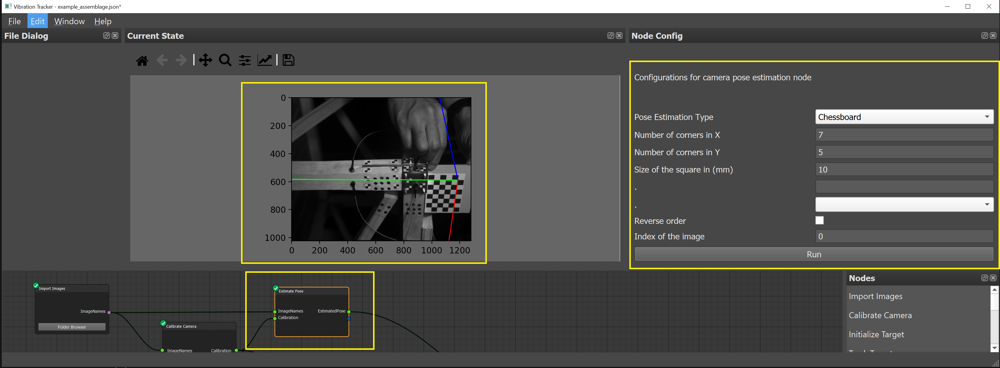
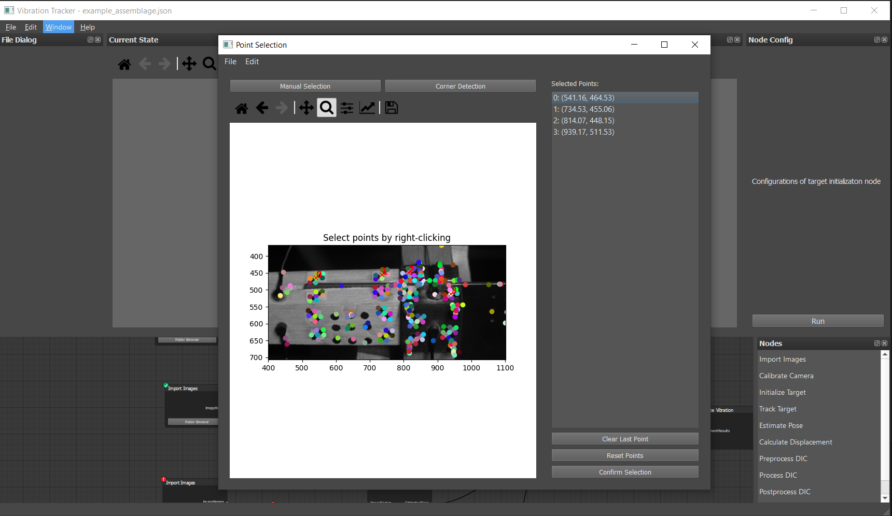
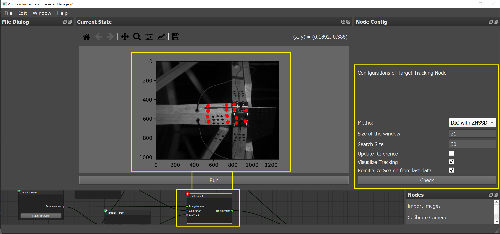
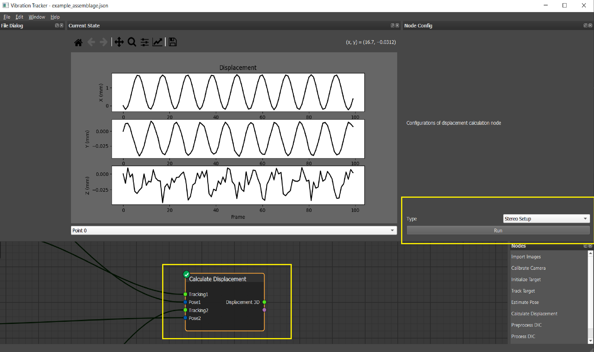

# Tutorial 2: 3D Displacement Measurement Using a Stereo Camera System

## Context

This tutorial demonstrates 3D displacement measurement using a stereo camera system, from calibration to displacement calculation.

**The developers acknowledge Layla Kordylas for this image dataset**

### **Setup**
- **Cameras**: Two Vieworks VC-12MX cameras with 35 mm lenses.
- **Experiment**: A timber structure with aluminum connections is tested on a vibration table. Markers are attached to parts of the structure, and the table excites the structure horizontally.
- **Data**: 100 sequential images are captured per camera. Calibration data (chessboard pattern) is also acquired. For computational efficiency, all images are resized to 1280 x 1024 pixels.
- This dataset `assembly_resized` can be downloaded using repository  
  Data is located in `./images/assembly_resized`:
  - **Camera 1 (CAM1)**:  
    - Calibration: `./images/assembly_resized/V1/calibration`  
    - Test: `./images/assembly_resized/V1/test`
  - **Camera 2 (CAM2)**:  
    - Calibration: `./images/assembly_resized/V2/calibration`  
    - Test: `./images/assembly_resized/V2/test`

| **First Image (CAM1)** | **First Image (CAM2)** |
|-------------------------|-------------------------|
|  |  |

| **Calibration Images (CAM1)** | **Calibration Images (CAM2)** |
|--------------------------------|--------------------------------|
|  |  |

---

## Image Processing Workflow with Vibration Tracker

Below is the pipeline for 3D displacement measurement with 2 cameras:

- *Nodes can be created by right-clicking or dragging them from the node list.*  
- *Alternatively, load the pre-built pipeline (`tutorials/example_assemblage.json`).*

---

## **Calibration for Camera 1**

### Step 1: Import Images

1. Click the **Folder Browser** button.
2. Locate the folder containing calibration images:  
   `./images/assembly_resized/V1/calibration`.

---

### Step 2: Camera Calibration

1. Add a **Calibrate Camera** node.
2. Configure the node in the **Node Config** widget:
   - Calibration panel: Choose *chessboard*.
   - Define chessboard properties:
     - **Number of corners (X)**: 7
     - **Number of corners (Y)**: 5
     - **Square size**: 10
   - Click **Run**.
3. A new window will display detected points on the calibration target.
4. After calibration, distortion-corrected images will appear in the *Current State* widget.

---

### Step 3: Pose Estimation

1. Add an **Estimate Pose** node.
2. Configure the node in the **Node Config** widget:
   - Pose estimation type: Select **Chessboard**.
   - Define chessboard properties:
     - **Number of corners (X)**: 7
     - **Number of corners (Y)**: 5
     - **Square size**: 10
   - Global coordinate image index: Set to 0 (use the first image for alignment).
   - Origin selection: Leave *Reverse Order* unchecked unless necessary.
3. Click **Run** to execute pose estimation.
4. The global X, Y, and Z axes (R, G, and B colors) will appear in the *Current State* widget.

---

## **Target Tracking for Camera 1**

### Step 1: Import Images

1. Click the **Folder Browser** button.
2. Locate the folder containing test images:  
   `./images/assembly_resized/V1/test`.

---

### Step 2: Initialize Targets with corner detection

1. Add an **Initialize Target** node.
2. Configure the node in the **Node Config** widget:
   - Click **Run**.
3. In the new window:
   - Select **Corner Detection** to visualize the detected corner position.
   - By approaching your mouse cursor, the marker of a corner point will be changed to cruciform.
   - Select with Right mouse button click, you can remove or reset selected points, by clicking **Clear Last Point**, **Reset Points**
   - After selected all your points in interest, click **Confirm Selection**
  
---

### Step 3: Track Targets

1. Add a **Track Target** node.
2. Configure the node in the **Node Config** widget:
   - **Tracking Method**: Choose **DIC with ZNSSD**.
   - **Subset Size**: Set to 21 pixels.
   - **Search Size**: Set to 30 pixels (or larger than the expected displacement between frame).
   - **Reference Options**: Disable *Update Reference Target*.
   - **Visualization**: Enable *Visualize Tracking* if needed.
   - **Reinitialize Search**: Enable *Reinitialize Search from Last Data*.
3. Click **Check** to preview the tracking window.
4. Click **Run** to execute the tracking process.

---

## **Repeat the Above Steps for Camera 2**

Ensure that:
- The X, Y, Z axes are aligned in the same coordinate system for both cameras.
- The target order matches between Camera 1 and Camera 2.

---

## **Calculate Displacement**

1. Add a **Calculate Displacement** node.
2. Configure the node in the **Node Config** widget:
   - Select **Stereo Setup**.
3. Click **Run** to compute 3D displacements.
4. Use the combobox to switch between points of interest.

---

## **Notes**

- All data is saved in a folder with the same name as your JSON file.
  For example, `example_assemblage.json` → `example_assemblage/`.
