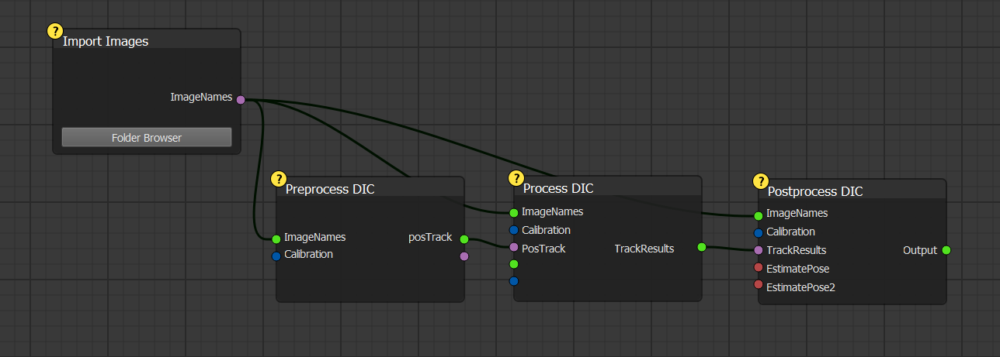
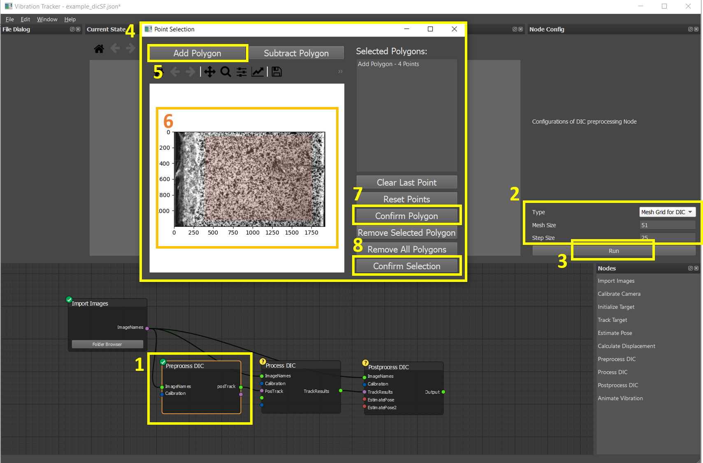
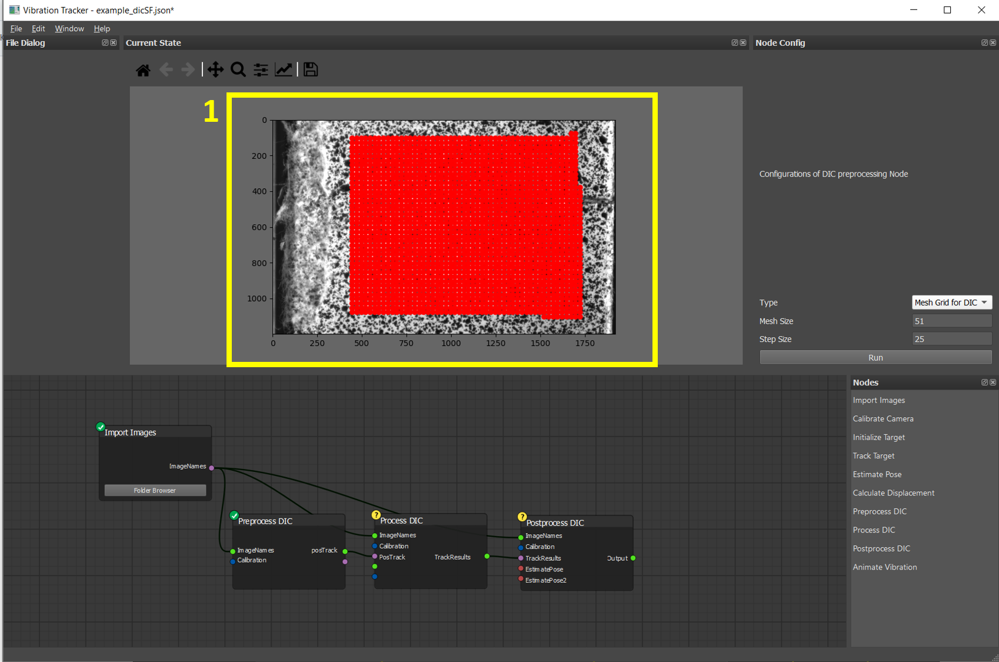
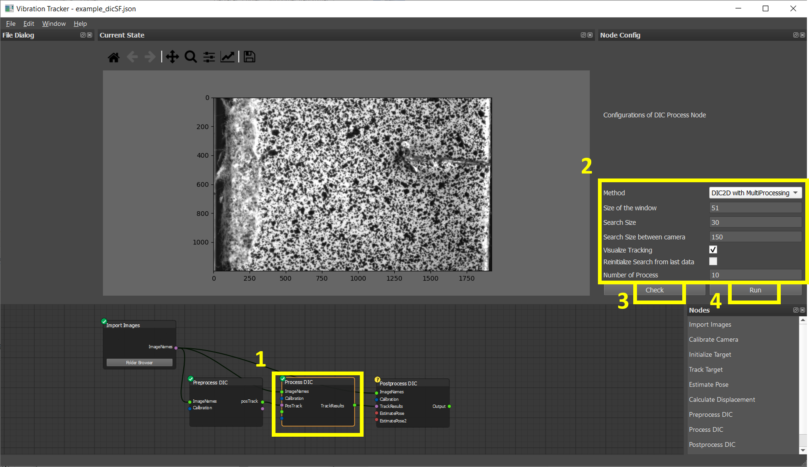
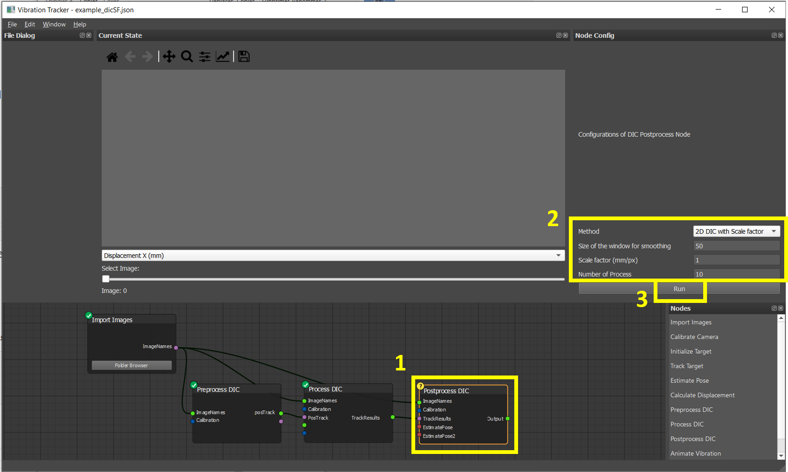
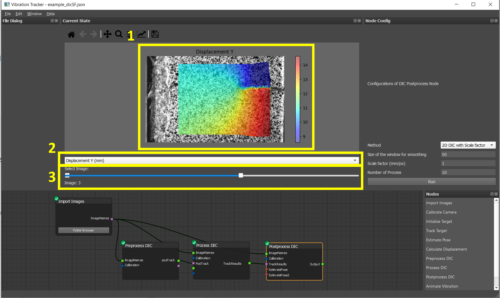

# Tutorial 3: Full-Field Measurement Using 2D DIC with Single Camera and Scale Factor

## Context

This tutorial demonstrates how to measure full-field displacements using 2D Digital Image Correlation (DIC) with a single camera and a known scale factor.

**The developers acknowledge Prof. SHIH, Ming-Hsiang for these DIC images**

  

### **Setup**
- **Camera**: Single grayscale camera
- **Target**: Speckle pattern applied to the specimen surface
- **Data**: Sequence of deformation images (e.g., 6 images). All images are preprocessed to a resolution of 1920 x 1200 pixels.
- **Folder**: `./images/dic2D/` contains all relevant images.
- This dataset `dic2D` can be downloaded using repository 

---

## Image Processing Workflow with VibrationTracker

Below is the processing pipeline used for this 2D DIC workflow:
*Alternatively, you can load the pre-built pipeline (`tutorials/example_dicSF.json`).*

1. **Import Images**  
2. **Preprocess DIC** – Define the mesh grid for tracking  
3. **Process DIC** – Perform tracking across frames  
4. **Postprocess DIC** – Calculate physical displacement using scale factor and deformation
---

## **Step 1: Import Images**

- Click the **Folder Browser** button on the `Import Images` node.
- Select the folder containing your test images (`./images/dic2D/`).

---

## **Step 2: Preprocess DIC**

**1.** Node Selection  
Select the **Preprocess DIC** node from the pipeline.

**2.** Configuration  
- Set **Type** to `Mesh Grid for DIC`  
  *(This method uses local DIC, which tracks the displacement at the center of each subset.)*  
- **Mesh Size**: 51  
  *(Specifies the size of each subset window in pixels.)*  
- **Step Size**: 25  
  *(Defines the spacing between adjacent subset centers in pixels.)*

**3.** Run the Node  
- Click **Run** to open the mesh region selection window.

**4.** Region of Interest (ROI) Selection  
A new window will appear where you can define the region(s) of interest (ROI) for DIC tracking.

**5.** Draw Polygon  
- Click **Add Polygon** to begin selecting a region.  

**6.** Define Polygon  
- Use the **right mouse button** to click multiple points and form a polygon around your desired area.  
- Once done, click **Confirm Polygon** **(7.)** to finalize it.

You can repeat this process to add multiple polygons:
- Use **Add Polygon** to include regions  
- Use **Subtract Polygon** to exclude regions

**8.** Confirm Selection  
- After defining all desired ROIs, click **Confirm Selection** to apply the mesh to the selected areas.

---

**Mesh Generation Result**  
  
Red grid points show the subset centers defined over the selected region.

---

## **Step 3: Process DIC**

**1.** Node Selection
- Select the **Process DIC** node.

**2.** Configuration
- **Method**: `DIC2D with MultiProcessing`  
- **Window Size**: 51  
  *(This value is inherited from the previous node and cannot be changed here.)*  
- **Search Size**: 30  
  *(Each subset is matched within a region ±30 pixels larger than its original position.)*  
- **Search Size between camera**: 150  
  *(This field is not used in the single-camera setup. It applies only to stereo DIC configurations.)*  
- **Visualize Tracking**: Enable this option if you want to see tracking results during processing.  
- **Reinitialize from Last Data**: Always enabled; tracking is automatically initialized from the last frame and cannot be disabled.  
- **Number of Process**: 10  
  *(Hover over this field to check how many CPU threads are available on your system.)*

**3.** Click **Check** to preview subsets
**4.** Click **Run** to start tracking

**Tracking Result**

  

  Multi-colored dots indicate successful tracking points.

---

## **Step 4: Postprocess DIC**

**1.** Node Selection  
- Select the **Postprocess DIC** node.

**2.** Configuration
- **Method**: `2D DIC with Scale Factor`  
- **Smoothing Window Size**: 50  
  *(Strain is calculated by fitting displacement values within a local window. If the smoothing window size is set to 50, a window of size 2 × 50 + 1 (i.e., 101 points) is used, centered at each tracking point. The displacement values of the points within this window are used for fitting to estimate the strain at the center point.)*  
- **Scale Factor**: 1 mm/px  
  *(Adjust this value according to your specific imaging setup to convert pixel displacements into physical units.)*  
- **Number of Process**: 10  
  *(Hover over the field to see the number of available CPU.)*

**3.** Click **Run** to compute displacements

---

##  **Visualize Result**

Displacement in Y direction (mm) shown as a colormap overlay.

**1.** Color Map  

**2.** Dropdown menu to select displacement component  
- Displacement X (mm), Y (mm), Strain XX, YY and XY

**3.** Use slider to navigate through frames

---

## **Notes**

- All project data will be saved in a folder named after the JSON file (e.g., `example_dicSF.json` → `example_dicSF/`)
- You can reuse the saved `example_dicSF.json` file to reload your workflow.

