# Tutorial 4: Measurement of displacement and strain with Digital Image Correlation (mono and stereovision)
### Made by Julien Archez with the new commits pushed in 2026. 

## Context

The purpose of this tutorial is to demonstrate how to use the software to measure displacement and strain using Digital Image Correlation (DIC) in two configurations:
1) Monovision (1 camera - 2D)
2) Stereovision (2 cameras - 3D)

This tutorial demonstrates the process of tracking targets on the beam using the following steps:

1. Import images
2. Preprocess DIC
3. Process DIC
4. Postprocess DIC

Three examples are presented in this tutorial. The corresponding images can be downloaded from the repository  
- In monovision: 
--Two images (reference and deformed) of a masonry bridge subjected to loading using a hydraulic cylinder, acquired with a 151 MPx Viework camera. These tests were carried out as part of Suzanne Leonard's PhD research (2024–2027): Residual bearing capacity of civil engineering masonry structures evaluation
--Nine images of an aluminum tensile test specimen acquired at the Navier Laboratory.
- In stereovision: 
--Intrinsic and extrinsic calibration images for the two cameras, together with eight images from the GM6 shake-table test of a U-shaped wall. These images were acquired during the study: Hoult R, Correia AA, Bertholet A, et al. Shake-table tests on two 40-ton reinforced concrete U-shaped walls with uniaxial and bidirectional-torsional response. Earthquake Spectra. 2025;41(5):4195-4226. doi:10.1177/87552930251378247

---

## 1) Monovision (1 camera - 2D)

Below is the pipeline for processing vibration tracking:

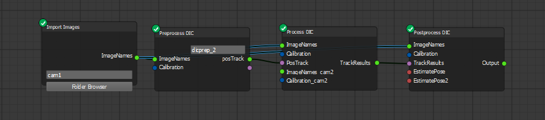

*Nodes can be created by right-clicking or dragging them from the node list.*  
*Alternatively, you can load the pre-built pipeline (`tutorials/Monovision.json`).*
*Remember to save your workflow regularly (File/save). If the software crashes, unsaved node names, node parameters, and node connections may be lost.*

---

### Step 1: Import Images

- Click the **Folder Browser** button and locate the folder containing the images.  
The first image of the folder will be used as the reference image.
You can rename the Import Images node (for instance, "cam1"). It will also change the name of the folder.
---

### Step 2: Preprocess DIC
1. Click the **Preprocess DIC** node.
2. In the **Node Config** widget, you can choose between two modes:

- **Mesh Grid for DIC** where you can choose the Size of the windows (also called subset) with mesh size. The number must be odd. Choose also the number of windows in line and column.
Press Run, a new window open. Click Add polygon and create a rectangle (4 corners polygon) then press Confirm Polygon and Confirm Selection.
It will create a regular grid inside the polygon.  

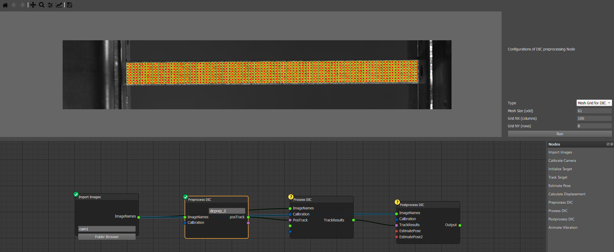

- **Polygon ROI** is more versatile because it can fill any polygon with subsets with a defined mesh size and step size. Press run. You can create a complex polygon with 'add polygon' or 'subtract polygon' to fit with the speciemn. 
You can for instance create a polygon, confirm polygon. Then subtract a polygon inside the created one (press confirm polygon too) and add another polygon...
At the end press Confirm selection to see the window (subset) created. You can zoom on the image to see better the windows.
A JSON file is created with all the position of the subsets (X,Y).

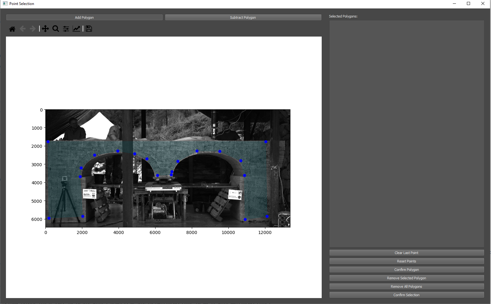
Create a polygon (add Polygon then confirm polygon)
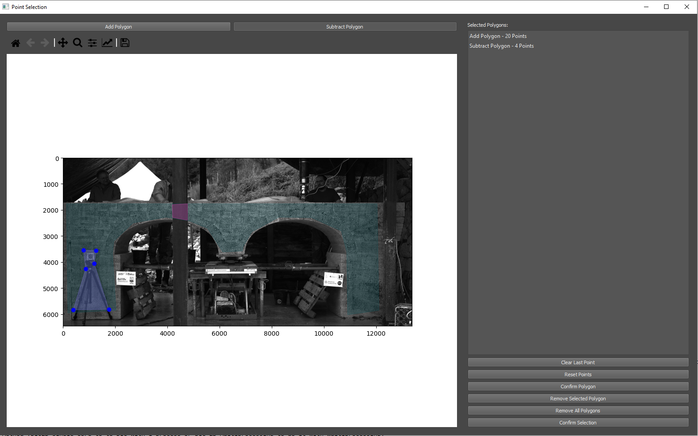
Subtract a polygon (Subtract Polygon then confirm polygon)
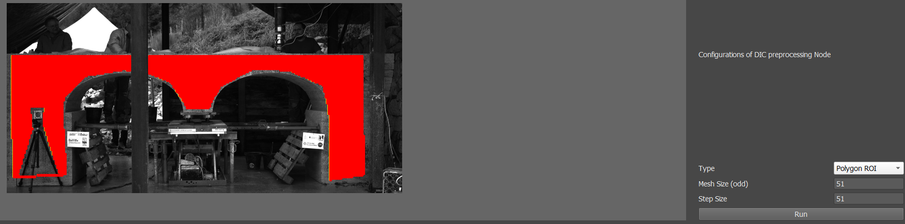
Confirm selection: see the subsets 
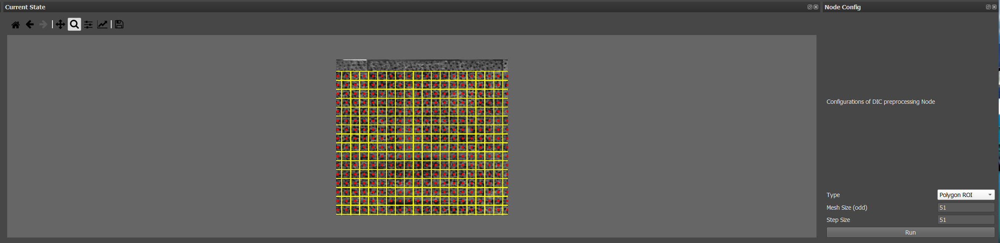
Zoom on the subsets created

Note that if you just want to select a few point on the image manually (without polygon), you can use the Initialize target node and connect it to process DIC.
The size of the window (subset) matter. It should be big enough to have approximatly minimum 3 black and white pattern (typically 31 pixels with a speckle of 3-5 pixels). The larger the subset, the more the random error decreases but the spatial resolution decreases.

---

### Step 3: Process DIC

1. Click the **Process DIC** node.
2. In the **Node Config** widgetyou can 
- choose the output folder name
- choose the Method (**DIC2D single core** to do DIC with 1 process or **DIC 2D Multiprocessing** to do it with multiprocessing). 3D will be presented in the 2nd case.
- choose the Interpolation method (bilinear or bicubic). Bicubic interpolation is generally more accurate but requires longer computation times.
- the size of the window (subset) as defined in the preprocess DIC node
- the search size (px) : if the displacement between two images is higher than the search size it won't find the subset duringthe DIC. However, increasing the search size also increases computation time and may increase the risk of incorrect matches. 
Try to estimate the maximum displacement of a subset between two images to find the optimized value.
- Vizualize tracking will let you monitor the tracking in real time in a new window however it increases the calculation time. Use it mainly to see if you have bad correlation and where.
- Number of Process : Choose the number of process you want for the calculation to do multiprocessing. Note that it will wait the result of an image before launching the calculation of the next one as the search size is based on the previous image (but the DIC is based on the reference image). 
Depending on the number of images and subsets it can take a few minutes or several hours. You can follow the advancement in the console.
At the end, a JSON with the coordinate of each subset at each step is created.

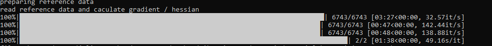
---

### Step 4: Post-process DIC

 Postprocess-DIC is used to calculate the triangulation in stereovision and to calculate the strain from the displacement calculated with Process DIC. 
1. Click the **Postprocess DIC** node.
2. In the **Node Config** widgetyou can select the Method to calculate the strain. In each Method you can enter the window size that will be used for the display and the number of process use for the calculation. 
	- **2D DIC with Homography** computes strain by fitting a local displacement function within a neighbourhood window around each tracked point. The displacement gradients obtained from this local fit are then used to compute the Green–Lagrange strain tensor. 
	Be careful if the window are too widely spaced, it won't calculate the strain (the strainField will be NaN). You can increase the window size in this case (or do another grid).

	- **2D DIC with scale factor** is identical to the Homography method but you can enter a scale to put the results in mm instead of pixel in the JSON displacementField and in the graphical display.

	- **2D DIC (contour strain: grid)** calculate the strain with the index of the window in a grid. So it only works with a grid where you enter the number of window in line and column (created with Mesh Grid for DIC in Preprocess DIC)
	The calculation of the strain is based with the an intregal of contour of the 8 neighbours around the subset (or less when the position is on the border/corner) and Green-Lagrange calculation with the strain gradient. 
	See the thesis "Michel Bornert. Morphologie microstructurale et comportement mécanique ; caractérisations expérimentales, approches par bornes et estimations autocohérentes généralisées. Ecole Nationale des Ponts et Chaussées, 1996." for more details about the calculation and method.

	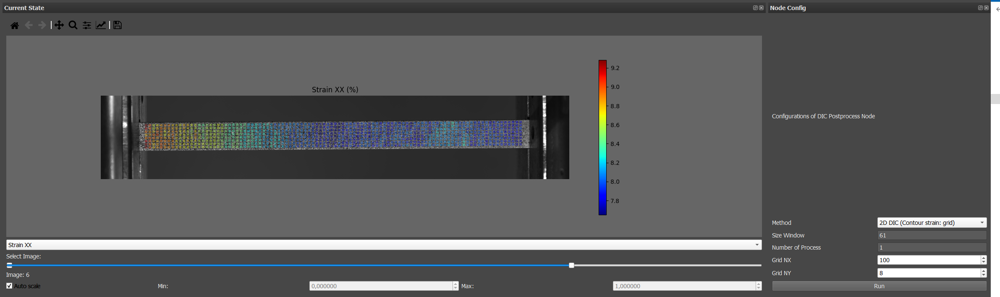

	- **2D DIC (contour strain: closer points)** calculate also the strain with an integral of contour of the 8 neighbour, but instead of taking the index in a grid, it will search for the neighbour window in 8 angles around the window. 
	To do it, it will calculate the median distance of the windows in the grid and multiply this distance by the distance factor and search the windows at a maximum of this distance. If several windows are found in an angle, it will take the closer. 
	You can set up the minimum and maximum windows to do the strain calculation and Write a debug report to know more about the finding of the neighbour. If not enough window are found, you can increase the distance factor.
	This method is more versatile as it can be used with any polygon you could create with Polygon ROI in Preprocess DIC.

	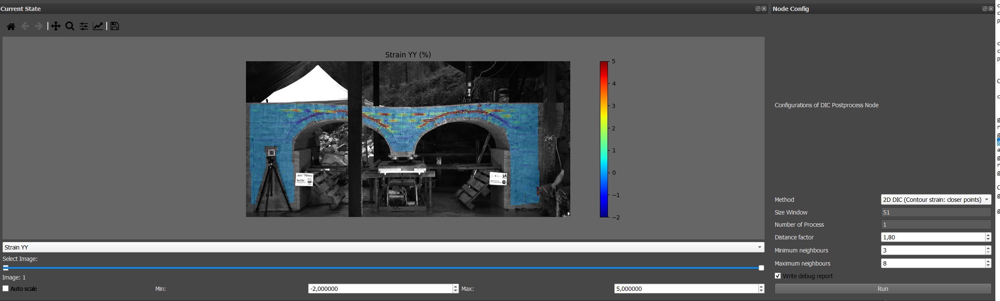

3.  The results are saved as one JSON file per image in the postprocess folder:

{
    "currentPoint": [[X0,Y0],...],
    "displacementField": [[Ux,Uy],...],
    "strainField": [[Exx,Eyy,Exy],...]
}

where:

- currentPoint contains the image coordinates of each subset centre.
- displacementField contains the displacement of each subset relative to the reference image.
- strainField contains the strain components [Exx, Eyy, Exy].

The displacement field is zero in DIC_postprocessing_0000.json because this file corresponds to the reference image.
The results are displayed and you can select the step, choose what you want to display (Displacement, strain...) and change the color scale (auto or with min/max values). (Don't put minimum value greater than the maximum value or it can crash)
Be careful : in the display, the value of strain are divided by 100 to be in % but not in the JSON file.

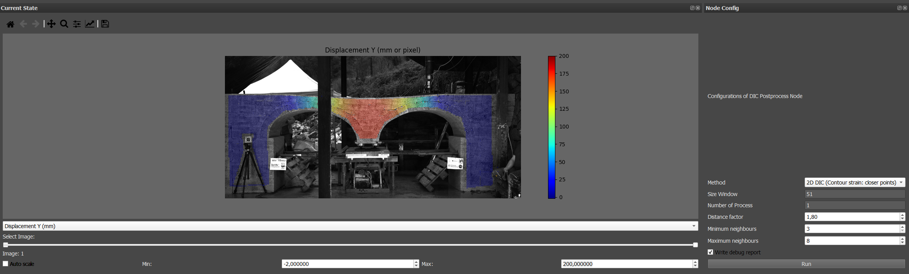

## 2) Stereovision (2 cameras - 3D)

Below is the pipeline for processing vibration tracking:

*Nodes can be created by right-clicking or dragging them from the node list.*  
*Alternatively, you can load the pre-built pipeline (`tutorials/Stereovision.json`).*
*Don't forget to save at each step or if it crash, you can lose the name or parameters entered or the node and connexions created.*

The process is here to do the extrinsic and intrinsic calibration of each camera and to do a Process DIC- 3D and a PostProcess DIC 3D

### Step 1: Intrinsic calibration

Intrinsic calibration estimates the optical parameters and lens distortion coefficients of each camera. These parameters are used to undistort the images and accurately reconstruct 3D coordinates. Make images of your calibration target on the whole sensor and with different orientations and import those images.
Connect it to the node **Calibrate Camera**.  Then choose your calibration pattern (Charuco, chessboard or even manual selection to select manually a few points on the calibration target if the chessboard is hard to find) and press Run. It will show the undistored image with some black at the border (depending on the quantity of distortion).
Repeat the procedure for the second camera. 
Note that the intrinsic calibration is better to do for more accuracy but it is not mandatory if the distortion is low.

### Step 2: Extrinsic calibration

Extrinsic calibration estimates the relative position and orientation between the two cameras, allowing stereo triangulation and 3D reconstruction. To do it, you must take a picture of the calibration target visible to both cameras. It is better to position the calibration target in the plan of your specimen for the coordinate axis.
Import the image and connect it to **Estimate Pose**. Connect also the out of Calibrate Camera. Then choose your calibration pattern and press Run.
It creates an image where X is in blue, Y in green and Z in red.
Repeat the procedure for the second camera.

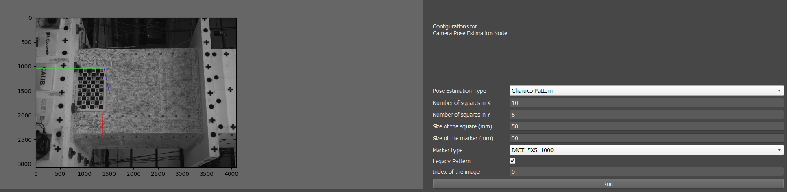

### Step 3: Preprocess DIC
As in 2D, the goal is to create the windows that will be followed in DIC. For the stereovision, you need to do it only on camera 1 as the process node will find the grid on camera 2.
You need to import the images in the folder of your test and connect the intrinsic calibration of camera 1 and create the windows as explained previously in Monovision-Step2

### Step 4: Process DIC (3D)

In the node **Process DIC** select the **DIC3D with multiprocessing**. You have now new connection in the node where you can connect the image sequence of camera 1, its intrinsic calibration, the Postrack coming from Preprocess DIC and the image and calibration of the 2nd camera.
The only parameter changing with 2D is the search size between cameras. Indeed, the Process DIC 3D will first find the reference window of the first image of the first camera in the first image of the second camera. You can evaluate this distance by checking manually what is the distance in pixels between a point from image of cam 1 with image of cam 2. 
The **DIC3D with multiprocessing** will then do a 2D DIC for each camera at each step.

### Step 5: Post Process DIC (3D)

In the **PostProcess DIC** node, select the method **3D DIC (Contour strain: closer point)** and choose the distance factor, min max neighbour like in 2D. The neighbour distances are only calculated with X and Y coordinate. 
Connect the image and calibration of camera 1 (used for the display), the TrackResults coming from Process DIC (made with DIC3D with multiprocessing) and the Estimate Pose of camera 1 and 2. As for Post process in 2D, you can modify the size window, number of process, distance factor and minimum and maximum neighbour. 
When you press run, it calculates the triangulation of the point from camera 1 and 2 thanks to the estimate pose made before. The 3D coordinates reconstructed from stereo triangulation are then rotated so that the specimen surface is approximately aligned with the XY plane (with Z close to 0). 
It finally calculates the 3D strain. 

The **3D DIC (Contour strain: grid)** runs in the same way as the 3D DIC (Contour strain: closer point) but works only with a grid where you enter the number or row and column (like the 2D Contour strain :grid).

The results are saved as one JSON file per image in the postprocess folder:

{
    "currentPoint": [[X,Y],...],
    "displacementField": [[Ux,Uy,Uz],...],
    "strainField": [[Exx,Eyy,Exy],...],
    "referencePoint3D": [[X,Y,Z],...],
    "currentPoint3D": [[X,Y,Z],...],
    "referencePoint3D_rot": [[X,Y,Z],...],
    "currentPoint3D_rot": [[X,Y,Z],...]
}

where:

- currentPoint contains the 2D image coordinates of each subset center in camera 1 and is used for visualisation.
- displacementField contains the 3D displacement of each subset relative to the reference configuration.
- strainField contains the strain components [Exx, Eyy, Exy].
- referencePoint3D and currentPoint3D contain the reconstructed 3D coordinates before rotation.
- referencePoint3D_rot and currentPoint3D_rot contain the coordinates used for strain computation (after the roration in the XY plan).

In the display, you can do the same operations as in 2D and you have 'displacement Z' added.
Note that although the method reconstructs 3D coordinates, stereovision is a surface measurements. The strain tensor is therefore computed on the reconstructed surface and only Exx, Eyy and Exy are reported (the strain gradient Fxz and Fyz are used in the strain calucation of Exx, Eyy and Exy).
Be careful : in the display, the value of strain are divided by 100 to be in % but not in the JSON file.

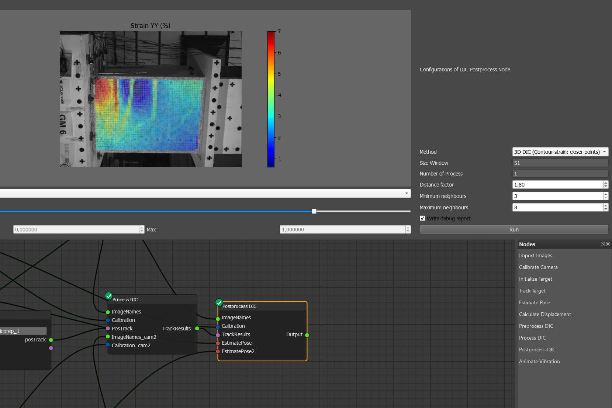

